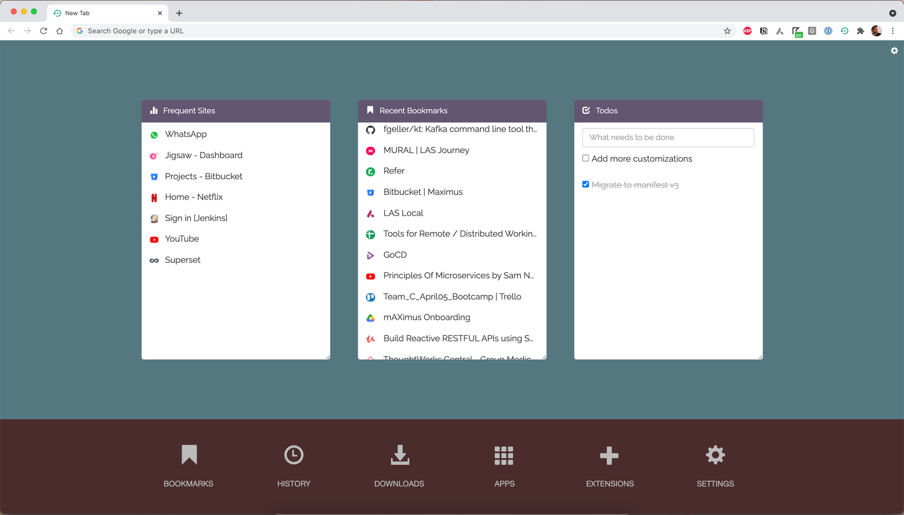

<h1 align="center">Welcome to Perfect-New-Tab 👋</h1>

   
  
  
  

> A Google Chrome extension that replaces the existing new tab with a more useful and feature-rich one. The extension can be installed for free from the [Chrome Store](https://goo.gl/HhJTdk)

## 📸 Screenshot

## ❓ What is it?
A Google Chrome extension that replaces the existing new tab with a more useful and feature-rich extension.

## 🤔 Why perfect new tab?
+ Useful shortcuts in the dock
+ Visit the Most frequent sites with ease
+ Visit recent bookmarks upfront
+ Todos app that lives in your new tab
+ Customizations

## 📝 Changelog
Version 6.0.1: Customization support added

## 🤝 Contributing
Comments and improvements are more than welcome!

Feel free to fork and open a pull request. Please make your changes in a specific branch and request to pull into master! If you can, please make sure the extensions fully works before sending the PR, as that will help speed up the process.

## 🙌 Show your support
Give a ⭐️ if you liked this!
