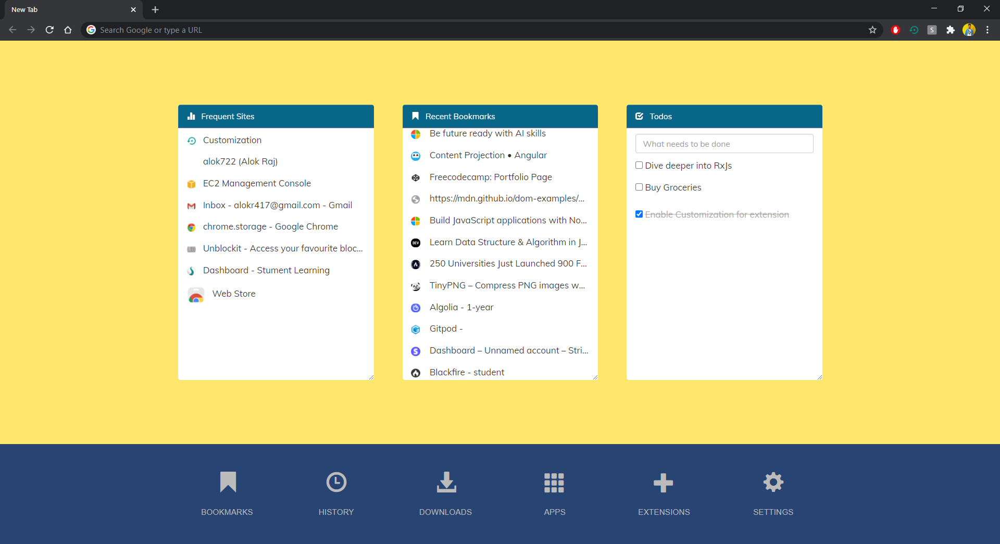

<h1 align="center">welcome to Perfect-New-Tab 👋</h1>

  
  
  

> A Google Chrome extension that replaces the existing new tab with a more useful and feature-rich one. The extension can be installed for free from [here](https://goo.gl/HhJTdk)

## 📸 screenshot

## ❓ what is it?

A Google Chrome extension that replaces the existing new tab with a more useful and feature-rich extension.

## 🤔 why perfect new tab?

+ Useful shortcuts in the dock (Like that of Firefox)
+ Visit the Most frequent sites with ease
+ A built-in simple Todos manager 
+ Change colors as your eye pleases
+ Very Lightweight

## 🤝 contributing
Comments and improvements are more than welcome!

Feel free to fork and open a pull request. Please make your changes in a specific branch and request to pull into master! If you can, please make sure the extensions fully works before sending the PR, as that will help speed up the process.

## 😎 contributer
+ Alok Raj : [LinkedIn](https://linkedin.com/in/alok722) [GitHub](https://github.com/alok722)

## 🙌 show your support

give a ⭐️ if you liked this!